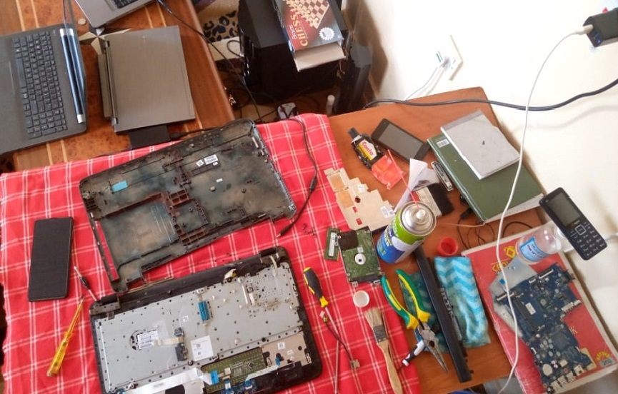

# mattsmm.github.io

<!DOCTYPE html>
<html lang="en">

<head>
  <meta charset="utf-8">
  <meta content="width=device-width, initial-scale=1.0" name="viewport">

  <title>MatthewsMugo</title>
  <meta content="" name="description">
  <meta content="" name="keywords">

  <!-- Favicons -->
  <link href="assets/img/logo2.png" rel="icon">
  <link href="assets/img/Logo2.png" rel="apple-touch-icon">
  

  <!-- Vendor CSS Files -->
  <link href="assets/vendor/bootstrap/css/bootstrap.min.css" rel="stylesheet">
  <link href="assets/vendor/font-awesome/css/font-awesome.min.css" rel="stylesheet">
  <link href="assets/vendor/ionicons/css/ionicons.min.css" rel="stylesheet">
  <link href="assets/vendor/owl.carousel/assets/owl.carousel.min.css" rel="stylesheet">
  <link href="assets/vendor/animate.css/animate.min.css" rel="stylesheet">
  <link href="assets/vendor/venobox/venobox.css" rel="stylesheet">

  <!-- Template Main CSS File -->
  <link href="assets/css/style.css" rel="stylesheet">
</head>

<body id="page-top">

  <!-- ======= Header/ Navbar ======= -->
  <nav class="navbar navbar-b navbar-trans navbar-expand-md fixed-top" id="mainNav">
    

      <a class="navbar-brand js-scroll" href="#page-top">Matthews M. Mugo</a>
      <button class="navbar-toggler collapsed" type="button" data-toggle="collapse" data-target="#navbarDefault" aria-controls="navbarDefault" aria-expanded="false" aria-label="Toggle navigation">
        
        
        
      </button>
      

        <ul class="navbar-nav">
          <li class="nav-item">
            <a class="nav-link js-scroll active" href="index.html">Home</a>
          </li>
          <li class="nav-item">
            <a class="nav-link js-scroll" href="#about">About</a>
          </li>
          <li class="nav-item">
            <a class="nav-link js-scroll" href="#service">Services</a>
          </li>
          <li class="nav-item">
            <a class="nav-link js-scroll" href="#work">Works</a>
          </li>
          <li class="nav-item">
            <a class="nav-link js-scroll" href="#contact">Contact</a>
          </li>
        </ul>
      

    

  </nav>

  <!-- ======= Intro Section ======= -->
  

    

    

      

        

          <!--
Hello, world!
-->
          <h1 class="intro-title mb-4">Meet Matthews Mugo</h1>
          
A well established Systems Administrator... ,Web Developer|Architect and Designer... , 
				with Excelence in End user and Customer support... ,Database Administrator... , Network and Security Expert...<strong class="text-slider"></strong>

          <!-- 
<a class="btn btn-primary btn js-scroll px-4" href="#about" role="button">Learn More</a>
 -->
        

      

    

  
<!-- End Intro Section -->

  <main id="main">

    <!-- ======= About Section ======= -->
    <section id="about" class="about-mf sect-pt4 route">
      

        

          

            

              

                

                  

                    

                      

                        
                      

                    

                    

                      

                        
Name:  Matthews M. Muriithi

                        
Profile:  Systems Administrator|Web Developer|Architect|Designer

                        
Email:  <email>matthewslearn@gmail.com</email>

                        
Phone:  +254 724 852 969

                      

                    

                  

                  

                    
Skill Attributes

                    MySQL Management and Reporting Services 87%
                    

                      

                    

					 User Support 90%
                    

                      

                    

					 Data Analysis 87%
                    

                      

                    

                    Firewall and Network Administration 75%
                    

                      

                    

                     Leadership 93%
                    

                      

                    

						Policy Formulation and implementation 90%
                    

                      

                    

                    Project management 85%
                    

                      

                    

                    HTML5 & CSS 68%
                    

                      

                    

                  

                

                

                  

                    

                      <h5 class="title-left" style="color:#1eee5c">
                        About me
                      </h5>
                    

                    

                      A seasoned leader with Computer Science Degree fron JKUAT and with over 4 years’ experience in Sacco Sector as a systems administrator and MIS manager. 
					  I possess vast knowledge in SQL management systems, SQL reporting servers, Data Analysis, Network administration, user support, policy formulation 
					  and implementation, cyber security and data protection, Risk analysis and mitigation, crisis management, web development, 
					  ERP systems, file sharing and VoIP Servers management and a host of other computer and customer service skills that

                    

                      Result-oriented, highly proficient ICT professional, passionate about Information, communication and technology, self motivated individual and 
					  committed to achieving my duty objectives. I pay attention to detail in activities that I undertake. Am open to learning new ideas and concepts, 
					  a very quick learner and adjusts fast to changing circumstances. I embrace and apply knowledge and skills gained to improve on service delivery and 
					  am keen to research for solutions when a challenge arises in the course of undertaking my duties.           

                    

                       Based on the technical knowledge realised over the number of years`, I envision on moving the Sacco sector to the Techworld  with ease and assured security 
					   while realising the optimum incomes through Technology.
                    

                  

                

              

            

          

        

      

    </section><!-- End About Section -->
<!-- Achievements section-->
    <section id="about" class="about-mf sect-pt4 route">
      

        

          

            

              

                

                  

                      <h5 class="title-left" style="color:#1eee5c">
                       Achievements
                      </h5>
                    

                  

                    

                      
<a class="badge-base__link LI-simple-link" href="https://www.linkedin.com/in/matthews-muriithi-3940b869/">Matthews - LinkedIn</a>

                

               
                      

                    
                  

                  

                

                
            

          

        

      

    </section>
    
    <!-- end of Achievements section-->
    <!-- ======= Services Section ======= -->
    <section id="service" class="services-mf route">
      

        

          

            

              <h3 class="title-a">
                Services
              </h3>
              

               Services.
              

              

            

          

        

        

          

            

              

                <i class="ion-monitor"></i>
              

              

                <h2 class="s-title">Web Design</h2>
                

                  I do web design for individuals and SME's ranging from cooking website designs, presonal portfolios,
                  redesign of already existing webs. My designs are motivated by extensiveresearch on the internet and thinking outside the box.
                

              

            

          

          

            

              

                <i class="ion-code-working"></i>
              

              

                <h2 class="s-title">Web Development</h2>
                

                  In developm,ent i involve mytself in more complex web application that recuire realtime databases and a functional backend. The development process involves several languages like php,java,msql and many other tools.
              

            

          

          

            

              

                <i class="ion-camera"></i>
              

              

                <h2 class="s-title">Photography $ Video</h2>
                

                  I am curently investing in gaing good devices for photography work. 
                  This will also include post shooting editing. 
                  It will also be a boost to my youtube channel content quality.
                   Curent photography is on a high px mobile device.
                

              

            

          

          

            

              

                <i class="ion-android-phone-portrait"></i>
              

              

                <h2 class="s-title">Phone $ PC fix</h2>
                

                  All computer fixes are addressed ranging from desktop to laptop repairs. this involves both 
                  hardware and software fixes.
                  Smart phone fixing, apps update and instalations and consultancy on best buy.

                

              

            

          

          

            

              

                <i class="ion-paintbrush"></i>
              

              

                <h2 class="s-title">Youtube</h2>
                

                  Here i do all kind of spiritual, motivational videos,
                   informing and fun videos too. Check us on the  youtube channel .link>> <u><a href="https://www.youtube.com/channel/UCN8JIivn7xsJRrNdSEx0aSw" style=" color:blue;"> HumbledMatt</a></u>>.
                

              

            

          

          

            

              

                <i class="ion-stats-bars"></i>
              

              

                <h2 class="s-title">Digital Marketing</h2>
                

                  I am always working tirelessly to make sure that content posted on 
                  my social media pages is creative and effective.
                   I also help you do this on your brands easily. 
                  Follow on twiter,instagram,facebook and whatsapp. 
                

              

            

          

        

      

    </section><!-- End Services Section -->

    <!-- ======= Counter Section ======= -->
    

      

      

        

          

            

              

                <i class="ion-checkmark-round"></i>
              

              

                
7

                MAJOR WORKS COMPLETED
              

            

          

          

            

              

                <i class="ion-ios-calendar-outline"></i>
              

              

                
4

                YEARS OF EXPERIENCE
              

            

          

          

            

              

                <i class="ion-ios-people"></i>
              

              

                
24

                TOTAL CLIENTS
              

            

          

          

            

              

                <i class="ion-ribbon-a"></i>
              

              

                
1

                AWARD WON
              

            

          

        

      

    
<!-- End Counter Section -->

    <!-- ======= Portfolio Section ======= -->
    <section id="work" class="portfolio-mf sect-pt4 route">
      

        

          

            

              <h3 class="title-a">
                Portfolio
              </h3>
              

                Some of my current and already finished works and Projects.
              

              

            

          

        

        

          

            

              <a href="assets/img/work-4.jpg" data-gall="portfolioGallery" class="venobox">
                

                  
                

                

                  

                    

                      <h2 class="w-title">PC REPAIR AND SERVICING</h2>
                      

                        Physical in shop / all days
                      

                    

                    

                      

                        
                      

                    

                  

                

              </a>
            

          

          

            

              <a href="assets/img/work-1.png" data-gall="portfolioGallery" class="venobox">
                

                  
                

                

                  

                    

                      <h2 class="w-title">VIDEO ,DIGITAL MARKETING & CREATIVES</h2>
                      

                        Digital Spaces / Regularly 
                      

                    

                    

                      

                        
                      

                    

                  

                

              </a>
            

          

         <!--  

            

              <a href="assets/img/work-6.jpg" data-gall="portfolioGallery" class="venobox">
                

                  
                

                

                  

                    

                      <h2 class="w-title">INVENTRA - INVENTORY I.S</h2>
                      

                        App Dev / Periodic
                      

                    

                    

                      

                        
                      

                    

                  

                

              </a>
            

          
 -->

        

      

    </section><!-- End Portfolio Section -->

    <!-- ======= Testimonials Section ======= -->
    

      

      

        

          

            

              

                

                  
                  Vee Lauren
                

                

                  

                    This guy is good as he is a consultant. had been stuck on hosting my site for about a month until i was introduced to him by a friend. Good going dk.
                  

                  <i class="fa fa-quote-right"></i>
                

              

              

                

                  
                  Marshal Myles
                

                

                  

                    Being a teacher i know a good one when i see them. So much information on your Youtube channel. ifeel like i am a techie myself already.
                  

                  <i class="fa fa-quote-right"></i>
                

              

            

           

        

      

    
<!-- End Testimonials Section -->

    <!-- ======= Blog Section ======= -->
   <!-- in future a blog will apear here -->
    <!-- End Blog Section -->

                  
    <section class="paralax-mf footer-paralax bg-image sect-mt4 route" style="background-image: url(assets/img/overlay-bg.jpg)">
      

      

        

          

            

              

                

                  

                    

                      <h5 class="title-left"style="color:#1eee5c">
                        Send Message
                      </h5>
                    

                    

                      <form action="forms/contact.php" method="post" role="form" class="php-email-form">
                        

                          

                            

                              <input type="text" name="name" class="form-control" id="name" placeholder="Your Name" data-rule="minlen:4" data-msg="Please enter at least 4 chars" />
                              

                            

                          

                          

                            

                              <input type="email" class="form-control" name="email" id="email" placeholder="Your Email" data-rule="email" data-msg="Please enter a valid email" />
                              

                            

                          

                          

                            

                              <input type="text" class="form-control" name="subject" id="subject" placeholder="Subject" data-rule="minlen:4" data-msg="Please enter at least 8 chars of subject" />
                              

                            

                          

                          

                            

                              <textarea class="form-control" name="message" rows="5" data-rule="required" data-msg="Please write something for us" placeholder="Message"></textarea>
                              

                            

                          

                          

                            
Loading

                            

                            
Your message has been sent. Thank you!

                          

                          

                            <button type="submit" class="button button-a button-big button-rouded" style="background-color: #1eee5c;">Send Message</button>
                          

                        

                      </form>
                    

                  

                  

                    

                      <h5 class="title-left"style="color:#1eee5c">
                        Get in Touch
                      </h5>
                    

                    

                      

                        You can get in touch through either of the following contants below.
                         Alternatively message me using the nessage box on the left.
                        Follow me on social media by clicking any of the social icon of your likig. Fing me anywhere on IG, Twiter, FB. etc etc
                      

                      <ul class="list-ico">
                        <li>16 Runyenjes Embu, Kenya</li>
                        <li> +254 724 852 969</li>
                        <li> matthewslearn@gmail.com</li>
                      </ul>
                    

                    

                      <ul>
                        <li><a href="https://www.facebook.com/humbledmatthews" target="_blank"><i class="ion-social-facebook"style="color:blue;"></i></a></li>
                        <li><a href="index.html" target="_blank"><i class="ion-social-instagram"></i></a></li>
                        <li><a href="https://twitter.com/humbledMatthews" target="_blank"><i class="ion-social-twitter"></i></a></li>
                        <li><a href="index.html" target="_blank"><i class="ion-social-pinterest"></i></a></li>
                      </ul>
                    

                  

                

              

            

          

        

      

    </section><!-- End Contact Section -->

  </main><!-- End #main -->

  <!-- ======= Footer ======= -->
  <footer>
    

      

        

          

            
&copy; Copyright <strong>MatthewsMugo &trade;</strong>.

 All Rights Reserved &reg;

            

             		&rarr; &clubs; Designed by <a href="MatthewsMugo">MatthewsMugo</a> 	&clubs; 	&larr;
            

          

        

      

    

  </footer><!-- End  Footer -->

  <a href="#" class="back-to-top"><i class="fa fa-chevron-up"></i></a>
  

  
  
  
  
  
  
  
  
  

  

</body>

</html>
